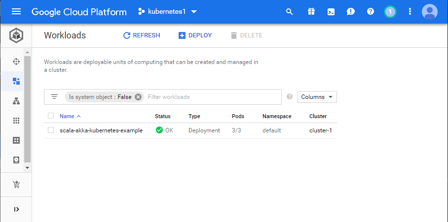

## Running image on Google Cloud Platform Kubernetes Engine

#### Prerequisites

A linux machine configured with the below. For this exercise one of the AWS nodes were used for this purpose.
* Docker runtime
* *gcloud* commandline tool - installed and initialised for Google Cloud Platform.

#### Pushing Docker image to GCP Container Registry

* Configure Docker to allow access to GCP repositories

```
$ gcloud auth configure-docker
The following settings will be added to your Docker config file
located at [/home/admin/.docker/config.json]:
 {
  "credHelpers": {
    "gcr.io": "gcloud",
    "us.gcr.io": "gcloud",
    "eu.gcr.io": "gcloud",
    "asia.gcr.io": "gcloud",
    "staging-k8s.gcr.io": "gcloud",
    "marketplace.gcr.io": "gcloud"
  }
}

Do you want to continue (Y/n)?  y

Docker configuration file updated.
```

* Tag the image and push to GCP Container Registry

Before an image can be deployed on Kubernetes Engine, it first needs to be pushed to the internal Container Registry. There is a number
of possible methods to do it, the below method allows using an already existing and published Docker image. 

```
$ docker image ls
REPOSITORY                                                    TAG                                 IMAGE ID            CREATED             SIZE
krzsam/examples                                               scala-akka-kubernetes-example-0.3   b4a6931c3a43        6 weeks ago         526MB

$ docker tag b4a6931c3a43 gcr.io/kubernetes1-250111/scala-akka-kubernetes-example-0.3

$ docker image ls
REPOSITORY                                                    TAG                                 IMAGE ID            CREATED             SIZE
krzsam/examples                                               scala-akka-kubernetes-example-0.3   b4a6931c3a43        6 weeks ago         526MB
gcr.io/kubernetes1-250111/scala-akka-kubernetes-example-0.3   latest                              b4a6931c3a43        6 weeks ago         526MB

$ docker push gcr.io/kubernetes1-250111/scala-akka-kubernetes-example-0.3
...
```

The image can be then seen in Container Registry console:


#### Creating Kubernetes Engine cluster

The cluster was created using Kubernetes Engine console:


Parameters of the cluster used:
* 3 nodes: 1vCPU, 3.75 GB memory, 10GB boot disk
* Kubernetes version used: 1.13.7-gke.19


The respective VMs created for the cluster can be seen in VM Instances console:


#### Deploying on cluster

The above created image in GCP Container Registry was deployed on the cluster:


Once the engine finishes the deployment, the application and the pods can be seen on the Kubernetes Engine console.




The last step is to expose the deployed application as a service with round-robin load-balancing available via an external IP.


As can be seen the service was exposed on an external IP 35.239.13.76 with port 9090 load-balanced and forwarded to the pods.

#### Test service availability

AWS host was used to connect to the external Service IP and port: 35.239.13.76:9090. The requests are load balanced between three available pods
(compare the pod names in list of managed pods above).
* SCALA-AKKA-KUBERNETES-EXAMPLE-8559BB849D-HHN9W
* SCALA-AKKA-KUBERNETES-EXAMPLE-8559BB849D-KLSGQ
* SCALA-AKKA-KUBERNETES-EXAMPLE-8559BB849D-DC6KP

```
$ curl 35.239.13.76:9090/get
{ "count": 530 , "hostname": "SCALA-AKKA-KUBERNETES-EXAMPLE-8559BB849D-HHN9W"  }
$ curl 35.239.13.76:9090/get
{ "count": 391 , "hostname": "SCALA-AKKA-KUBERNETES-EXAMPLE-8559BB849D-KLSGQ"  }
$ curl 35.239.13.76:9090/get
{ "count": 392 , "hostname": "SCALA-AKKA-KUBERNETES-EXAMPLE-8559BB849D-KLSGQ"  }
$ curl 35.239.13.76:9090/get
{ "count": 531 , "hostname": "SCALA-AKKA-KUBERNETES-EXAMPLE-8559BB849D-HHN9W"  }
$ curl 35.239.13.76:9090/get
{ "count": 531 , "hostname": "SCALA-AKKA-KUBERNETES-EXAMPLE-8559BB849D-HHN9W"  }
$ curl 35.239.13.76:9090/get
{ "count": 393 , "hostname": "SCALA-AKKA-KUBERNETES-EXAMPLE-8559BB849D-DC6KP"  }
$ curl 35.239.13.76:9090/get
{ "count": 531 , "hostname": "SCALA-AKKA-KUBERNETES-EXAMPLE-8559BB849D-HHN9W"  }
$ curl 35.239.13.76:9090/get
{ "count": 393 , "hostname": "SCALA-AKKA-KUBERNETES-EXAMPLE-8559BB849D-KLSGQ"  }
$ curl 35.239.13.76:9090/get
{ "count": 393 , "hostname": "SCALA-AKKA-KUBERNETES-EXAMPLE-8559BB849D-KLSGQ"  }
$ curl 35.239.13.76:9090/get
{ "count": 532 , "hostname": "SCALA-AKKA-KUBERNETES-EXAMPLE-8559BB849D-HHN9W"  }
$ curl 35.239.13.76:9090/get
{ "count": 393 , "hostname": "SCALA-AKKA-KUBERNETES-EXAMPLE-8559BB849D-KLSGQ"  }
$ curl 35.239.13.76:9090/get
{ "count": 394 , "hostname": "SCALA-AKKA-KUBERNETES-EXAMPLE-8559BB849D-DC6KP"  }
$ curl 35.239.13.76:9090/get
{ "count": 532 , "hostname": "SCALA-AKKA-KUBERNETES-EXAMPLE-8559BB849D-HHN9W"  }
$ curl 35.239.13.76:9090/get
{ "count": 532 , "hostname": "SCALA-AKKA-KUBERNETES-EXAMPLE-8559BB849D-HHN9W"  }
```


